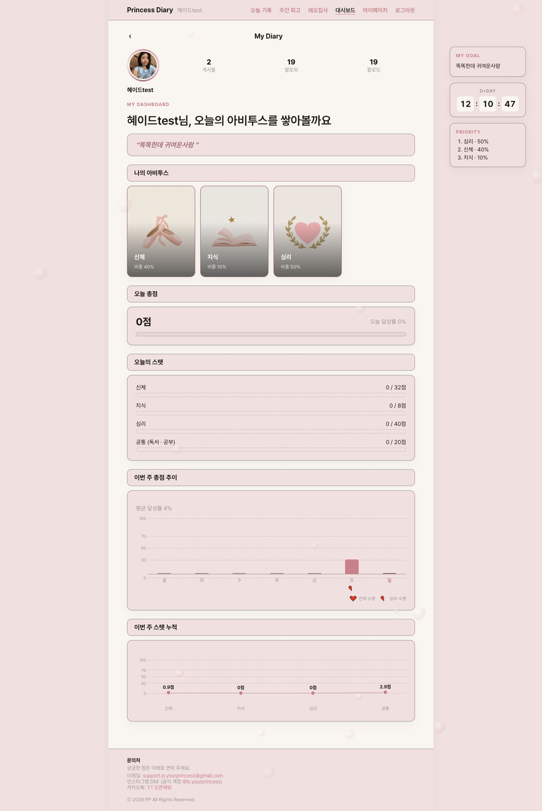
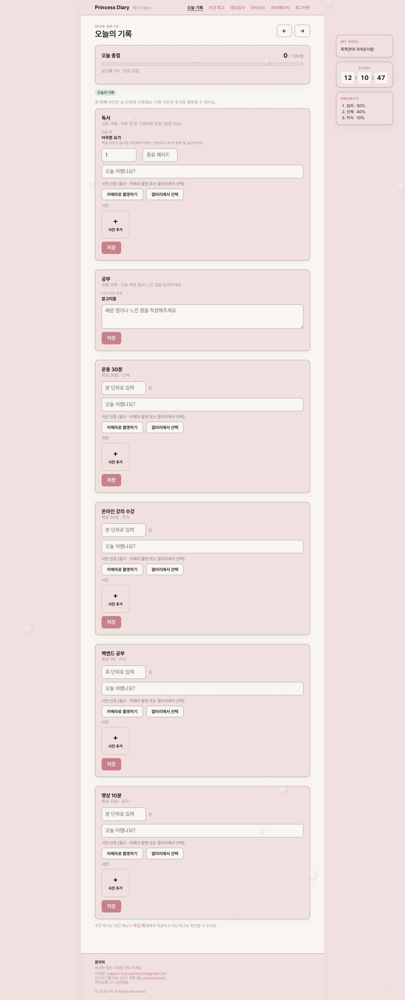
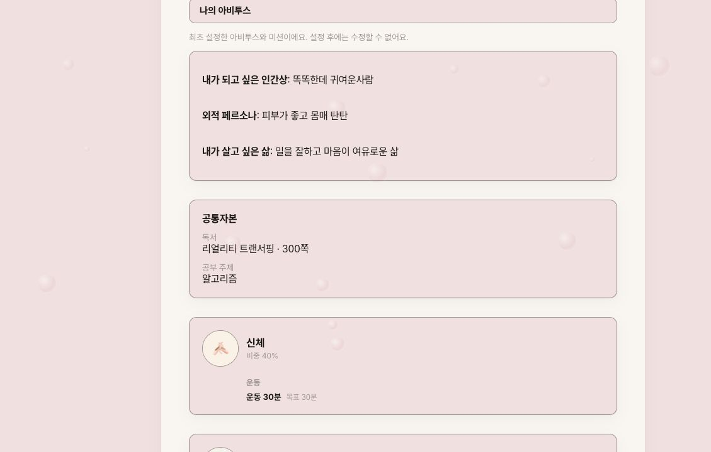
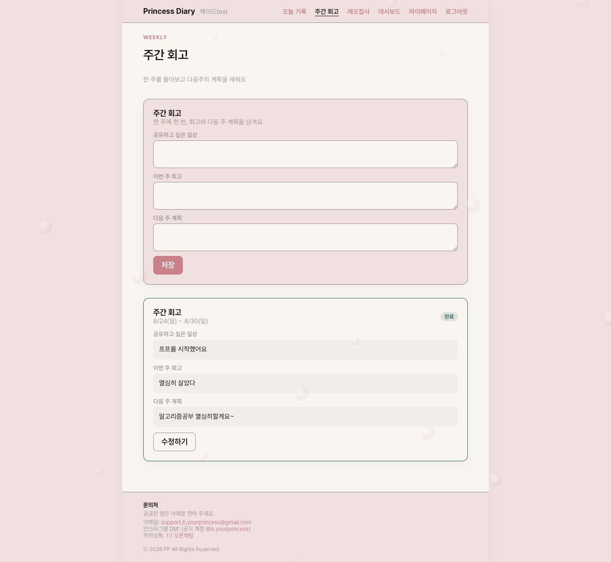
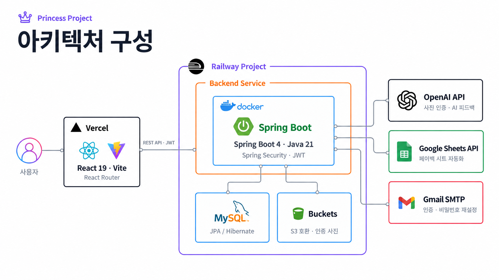
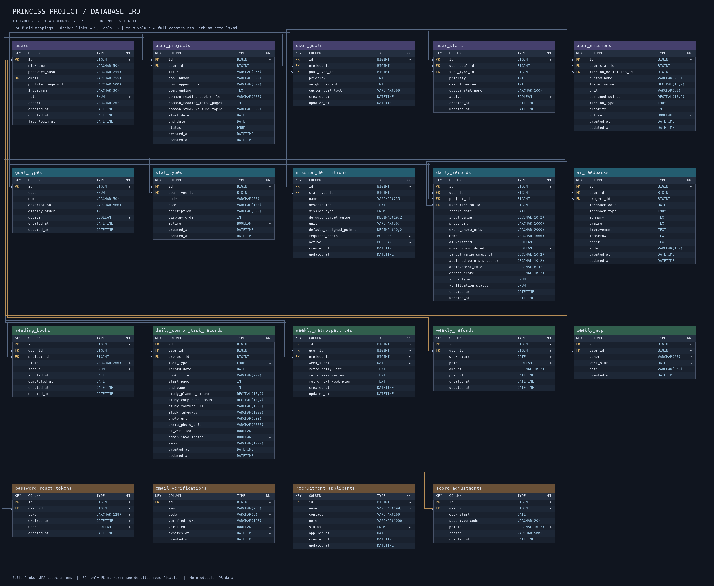

# 👑 프린세스 프로젝트 (Princess Project)

> 🕹 정해진 파멸 엔딩을 바꾸는, 30일 자기계발 챌린지

## 소개 — 판타지 세계관

**당신은 30일 뒤 정치적 계략의 희생으로 파멸할 운명의 조연인 ‘시녀’에 빙의했습니다.**

주어진 시간은 딱 30일. 매일의 선택과 성장으로 정해진 결말을 ‘공주’로 바꾸고, ‘나’라는 캐릭터의 새로운 엔딩을 만들어갑니다. 프린세스 프로젝트는 이 서사를 빌려 **현실의 나를 30일 동안 성장시키는 자기계발 챌린지**입니다.

### Developer

| 김혜윤 |
| :---: |
| 기획 · Full-Stack · Infra |
| [gpdbs9409](https://github.com/gpdbs9409) |

### 개발 기간 및 서비스

**2026.07.10 – 진행 중 (Live)**

## 문제 인식 및 기획 배경

자기계발을 시작할 때는 의욕이 높지만, 매일 무엇을 실천할지 정하고 그 변화를 확인하는 일은 쉽지 않습니다. 프린세스 프로젝트는 다음 세 가지 질문에서 출발했습니다.

| 기획 질문 | 서비스의 접근 |
| --- | --- |
| 막연한 ‘더 나은 나’를 어떻게 행동으로 옮길까? | 원하는 캐릭터를 구체화하고, 집중할 자본과 실행할 미션을 직접 선택합니다. |
| 반복되는 기록에 어떻게 의미를 부여할까? | 30일의 세계관과 데일리 인증, AI 피드백을 연결해 하루의 실천을 성장 과정으로 남깁니다. |
| 작은 변화가 쌓이는 모습을 어떻게 보여줄까? | 일별 점수와 달성률, 주간 스탯과 회고로 실천의 흐름을 확인합니다. |

단순한 완료 표시를 넘어 **목표 설정 → 실천 → 인증 → 피드백 → 회고**가 이어지는 경험을 지향합니다.

## 주요 기능

### 1. 프린세스 다이어리 — 데일리 인증과 AI 피드백

미션 수행량과 소감, 인증 사진을 남기고 날짜별 기록을 확인합니다. 독서는 읽은 페이지와 사진을, 공부는 오늘 배운 점과 느낀 점을 기록합니다.

- 사진 인증에 OpenAI의 이미지 분석 기능을 활용합니다.
- AI 피드백으로 하루의 실천을 돌아보고 다음 행동의 방향을 잡습니다.
- 대시보드에서 오늘의 점수·달성률과 이번 주의 성장 흐름을 확인합니다.

데일리 인증 화면 보기

### 2. 아비투스 7자본 — 나만의 캐릭터와 미션 설계

성장을 **심리 · 문화 · 지식 · 경제 · 신체 · 언어 · 상징**의 7가지 자본으로 나누어 바라봅니다. 이 중 집중할 **3개 자본**을 선택하고 비중과 미션을 설정합니다.

내가 되고 싶은 인간상, 외적 페르소나, 살고 싶은 삶을 구체화하고 실천할 행동으로 연결합니다. 개인 미션에 모두가 함께하는 **공통과제 3종(독서 · 공부 · 주간 회고)**을 더합니다.

### 3. 주간 회고 — 실천을 다음 주의 계획으로

공유하고 싶은 일상, 이번 주 회고, 다음 주 계획을 기록합니다. 이전 회고를 다시 읽으며 자신의 변화와 다음 실천을 연결할 수 있습니다.

주간 회고 화면 보기

## 앞으로의 확장 — 엔딩 리포트

30일의 미션 참가 데이터를 바탕으로 **달성 엔딩명, 30일 타임라인, 7자본 성장 분석, Before & After 비교**를 담은 개인별 결과물을 제공하는 것을 목표로 합니다.

> 완주 데이터를 성장 서사로 연결하는 확장 방향입니다. 현재 README에는 구현을 확인한 서비스 화면만 수록했습니다.

## 이렇게 진행돼요

1. **캐릭터 설계** — 내가 되고 싶은 모습과 목표를 구체화합니다.
2. **자본·미션 설정** — 집중할 3개 자본과 비중, 실행할 미션을 정합니다.
3. **매일 인증** — 프린세스 다이어리에 수행량·사진·소감을 기록합니다.
4. **성장 확인** — 대시보드와 AI 피드백으로 실천을 돌아봅니다.
5. **주간 회고** — 한 주를 정리하고 다음 주의 계획을 세웁니다.

| 공간 | 역할 |
| --- | --- |
| 카카오톡 단톡방 | 공지 · 리마인더 · 소통 |
| 프린세스 다이어리 | 데일리 인증 · 성장 확인 · 주간 회고 |

## 기대효과

- **목표의 구체화**: 원하는 모습을 자본과 미션으로 나누어 오늘 할 일을 정합니다.
- **꾸준한 실천 지원**: 인증과 피드백을 통해 매일의 행동을 돌아볼 기회를 만듭니다.
- **성장 과정의 가시화**: 점수와 주간 기록을 통해 변화의 흐름을 확인합니다.
- **운영 업무 효율화**: 인증 확인과 관리자 정산 시트 연동으로 반복 작업을 줄이는 것을 지향합니다.

위 내용은 서비스가 지향하는 효과입니다. 완주율·리텐션·운영 시간 절감 등의 정량 성과는 측정 후 추가할 예정입니다.

## 활용 기술 및 도구

| 영역 | 기술 |
| --- | --- |
| Frontend | React 19 · TypeScript · Vite · React Router |
| Backend | Spring Boot 4 · Java 21 · Spring Security · JWT · Spring Data JPA |
| Database | MySQL |
| Infra / Deploy | Vercel · Railway · Docker · Railway Buckets(S3 호환) |
| AI | OpenAI API — 사진 인증 `gpt-4.1-mini`, 텍스트 피드백 `gpt-4o-mini` |
| 외부 연동 | Google Sheets API · Spring Mail(SMTP) |
| 협업 / 형상 관리 | GitHub |

AI 모델명은 현재 코드의 기본 설정 기준이며, 환경변수로 변경할 수 있습니다.

## 아키텍처 구성

- **Frontend**: React Router 기반 SPA를 Vercel에 배포합니다.
- **Backend**: Spring Security와 JWT로 API 인증을 처리하고, JPA/Hibernate로 데이터를 관리합니다.
- **Storage**: 인증 사진을 S3 호환 스토리지에 저장하고 백엔드를 통해 제공합니다.
- **운영 연동**: Google Sheets 기반 페이백 관리와 SMTP 메일 발송을 지원합니다.

### 배포 환경

| 브랜치 | Frontend (Vercel) | Backend (Railway) |
| --- | --- | --- |
| `develop` | `dev-princess-project` | `dev` |
| `main` | `princess-project-2026` | `production` |

변경은 dev에 먼저 반영하여 실제 기능을 검증합니다. 운영 반영은 해당 변경에 대한 명시적 승인 후 진행합니다.

## ERD

현재 JPA 모델의 **19개 테이블 · 194개 컬럼**을 담은 전체 ERD입니다. 테이블별 컬럼명, 데이터 타입, PK·FK·UK, NOT NULL을 표시했습니다.

이미지를 클릭하면 확대 가능한 SVG 원본을 볼 수 있습니다.

- [전체 컬럼·ENUM·복합 UNIQUE·CHECK·인덱스 상세 명세](docs/schema-details.md)
- [편집 가능한 DBML 원본](docs/schema.dbml)
- [고해상도 PNG](docs/images/erd.png) · [SVG 원본](docs/images/erd.svg)

실선은 JPA 연관관계, 점선은 기존 SQL에만 선언된 FK입니다. 현재 모델과 기존 SQL의 제약조건 차이는 상세 명세에 구분해 기록했습니다.

---

화면은 2026년 9월 13일 dev 환경의 테스트 계정에서 캡처했습니다. 화면에 표시된 기록·점수는 서비스 성과 지표가 아닌 테스트 데이터입니다.
